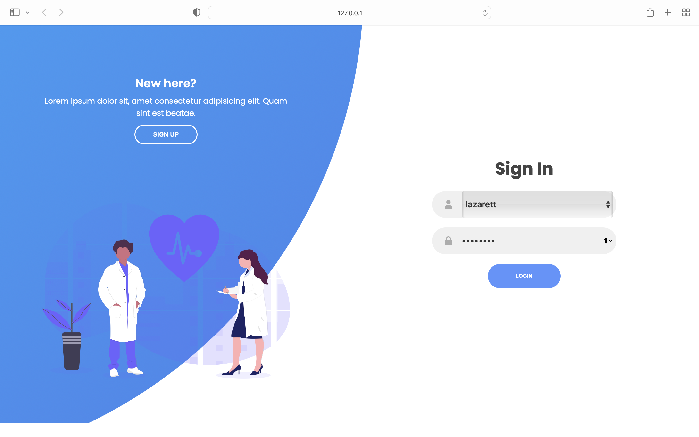
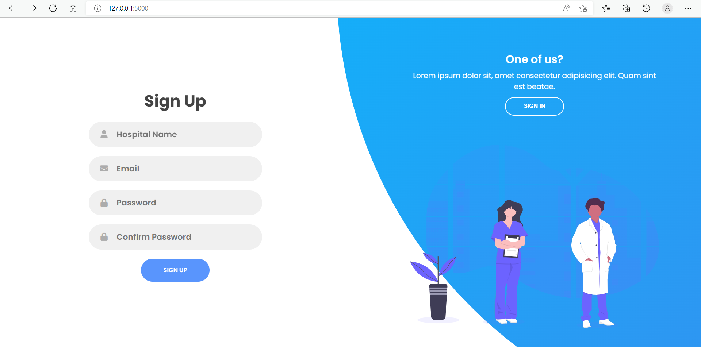
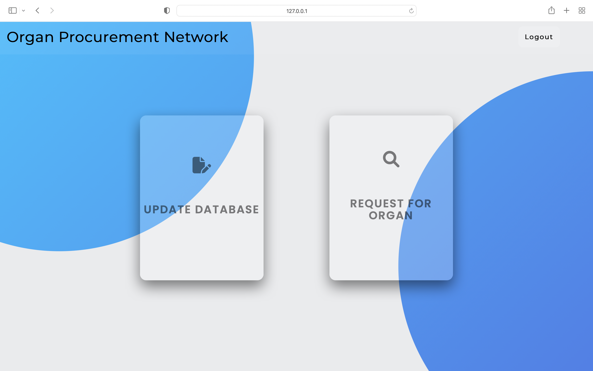
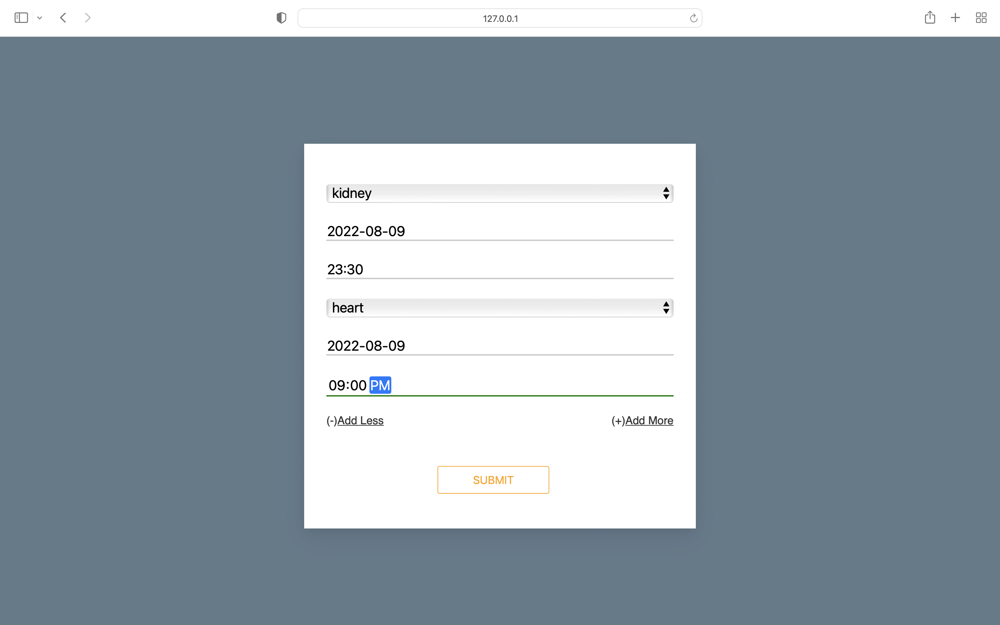
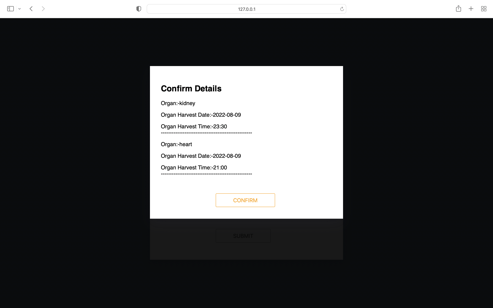
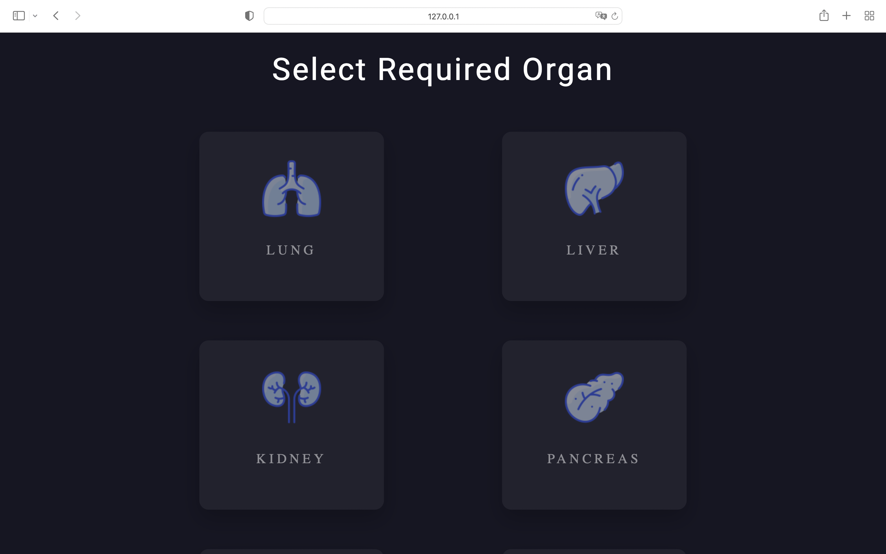
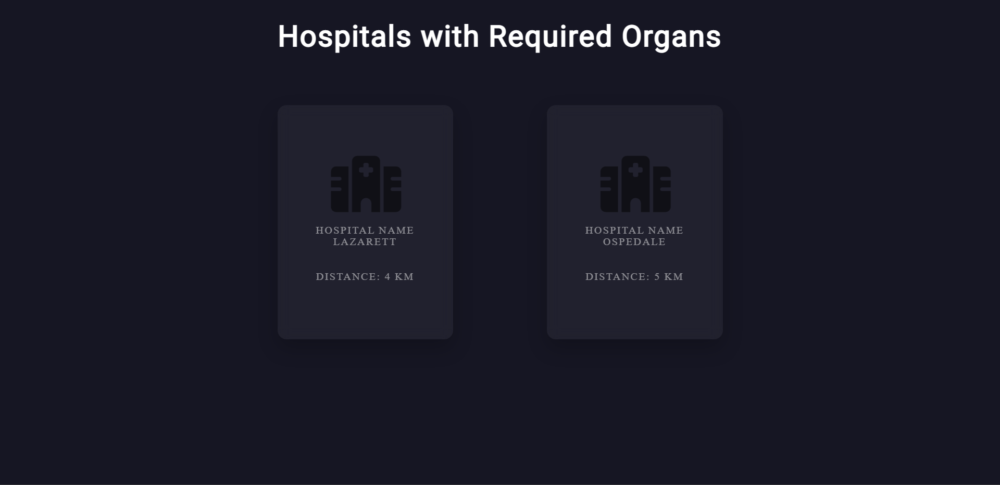

# Organ Procurement Network

A web application that aids hospitals in organ transplantation.  

Hospitals will be able to request for a required organ and the hospitals with the required organ will be displayed according to their distance.  Surplus organs in a hospital can also be updated in the database.
## Tech Stack

**Front End:** HTML, CSS, JavaScript

**Back End:** Python, CSV Files

**Frameworks:** Flask, Jinja2


## Run Locally

Clone the project

```bash
  git clone https://link-to-project
```

Go to the project directory

```bash
  cd /path/to/project
```

Install dependencies

```bash
  pip install requirements.txt
```

Start the server

```bash
  python app.py runserver
```


## Credentials 
| Hospital Name | Password |
| ----------- | ----------- |
| malin       | psword       |
| aspatre   | helloworld        |
| lazarett   | savlives        |
| ospedale   | iloquis        |
| ziekenhuis     | medsch        |


## Screenshots








